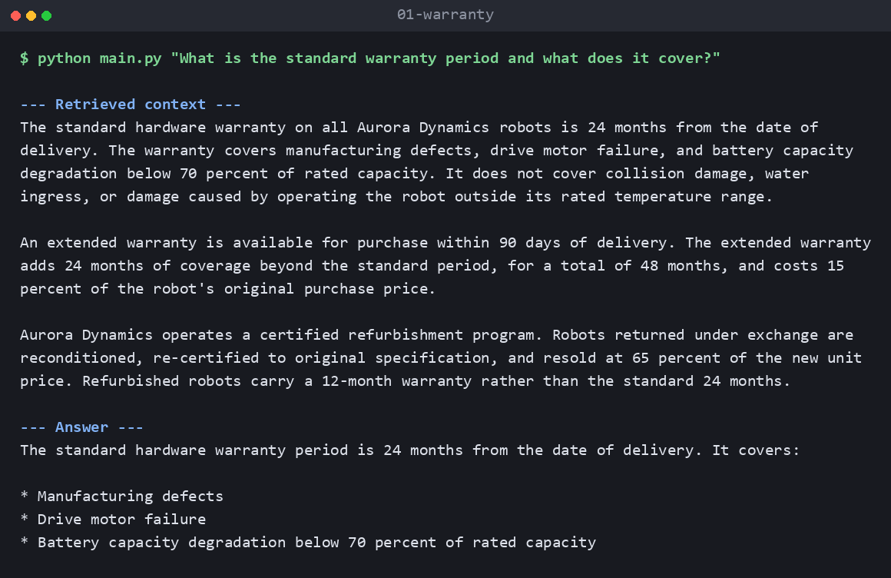
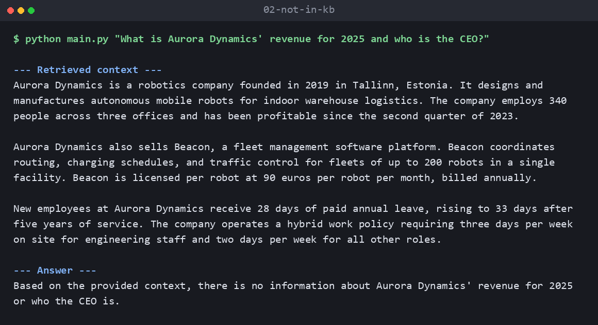
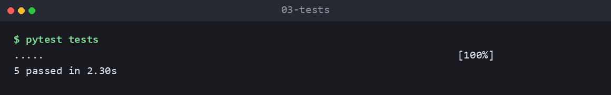

# Agentic RAG — Retriever + Report Generator

A minimal two-agent Retrieval-Augmented Generation workflow built with LangGraph and Gemini.

A question goes to a **Retriever Agent**, which calls a retrieval tool against a local
`knowledge_base.txt`. The retrieved passages are handed to a **Report Generator Agent**,
which answers using only that context. The two responsibilities never mix.

## Workflow

```
User
  ↓
Retriever Agent  ──►  Retriever Tool  ──►  knowledge_base.txt
  ↓
Report Generator Agent
  ↓
Final Answer
```

The graph is strictly linear — no loops, no reflection, no planning agent.

## Project structure

```
main.py                 CLI entry point (thin: no business logic)
knowledge_base.txt      The only knowledge source
src/
  config.py             Model IDs, retrieval settings, model factories
  agents/
    retriever_agent.py           Calls the retrieval tool. Never answers.
    report_generator_agent.py    Answers from context. Never retrieves.
  tools/
    document_loader.py  Reads and splits the knowledge base
    retriever.py        Embedding-based search, exposed as a LangChain tool
  graph/
    state.py            Shared workflow state
    workflow.py         Sequential LangGraph wiring
  prompts/              One prompt per agent
tests/                  Tests for the pure retrieval logic
docs/                   Project context, architecture, and decision log
```

## Setup

Requires Python 3.10 or newer.

```bash
python -m venv .venv
.venv\Scripts\activate          # Windows
# source .venv/bin/activate     # macOS / Linux

pip install -r requirements.txt
```

Add your API key — get one from [Google AI Studio](https://aistudio.google.com/apikey):

```bash
copy .env.example .env          # Windows
# cp .env.example .env          # macOS / Linux
```

Then edit `.env` and set `GOOGLE_API_KEY`.

## Running

```bash
python main.py "What is the standard warranty period?"
```

Or run without an argument to be prompted:

```bash
python main.py
```

The retrieved context is printed alongside the answer, so the split between the two
agents is visible in the output.

### Example

```
$ python main.py "What is the standard warranty period and what does it cover?"

--- Retrieved context ---
The standard hardware warranty on all Aurora Dynamics robots is 24 months from the
date of delivery. The warranty covers manufacturing defects, drive motor failure, and
battery capacity degradation below 70 percent of rated capacity. It does not cover
collision damage, water ingress, or damage caused by operating the robot outside its
rated temperature range.

An extended warranty is available for purchase within 90 days of delivery. The extended
warranty adds 24 months of coverage beyond the standard period, for a total of 48
months, and costs 15 percent of the robot's original purchase price.

Aurora Dynamics operates a certified refurbishment program. Robots returned under
exchange are reconditioned, re-certified to original specification, and resold at 65
percent of the new unit price. Refurbished robots carry a 12-month warranty rather than
the standard 24 months.

--- Answer ---
The standard warranty period is 24 months from the date of delivery. It covers:

* Manufacturing defects
* Drive motor failure
* Battery capacity degradation below 70 percent of rated capacity
```

When the knowledge base does not cover the question, the Report Generator says so
instead of answering from the model's own knowledge:

```
$ python main.py "What is Aurora Dynamics' revenue for 2025 and who is the CEO?"

--- Answer ---
Based on the provided context, there is no information about Aurora Dynamics' revenue
for 2025 or who the CEO is.
```

More verified runs, including the error paths, are in
[`docs/example_run.md`](docs/example_run.md).

### Screenshots

Answering from the knowledge base — the retrieved passages and the grounded answer:



A question the knowledge base cannot answer. Note that retrieval still ran and returned
three passages; none of them mention revenue or a CEO, so the Report Generator declines
rather than inventing them:



Tests:




## Tests

```bash
pytest tests
```

These cover the chunking and similarity logic only. They need no API key and make no
network calls — the LLM-dependent paths are verified by running the application.

## How it works

**Retrieval.** `knowledge_base.txt` is split into paragraph chunks, each embedded once
per process with `gemini-embedding-001`. A question is embedded the same way, and the
top 3 chunks by cosine similarity are returned. There is no vector database — at this
corpus size a numpy dot product is the whole implementation.

**Tool use.** The retrieval function is a real LangChain `@tool`. The Retriever Agent
binds it to the model and takes exactly one tool-calling turn, so the agent genuinely
decides to call the tool rather than the code calling it directly. One turn, never a loop.

**Grounding.** The Report Generator receives only the retrieved context and is instructed
to answer from it alone, and to say so plainly when the context does not cover the
question. It has no import path to any retrieval code.

## Design decisions

The reasoning behind the framework, model, and retrieval choices — including what was
deliberately left out and why — is recorded in [`docs/DECISIONS.md`](docs/DECISIONS.md).
Project scope and architecture are in [`docs/PROJECT_CONTEXT.md`](docs/PROJECT_CONTEXT.md)
and [`docs/ARCHITECTURE.md`](docs/ARCHITECTURE.md).
